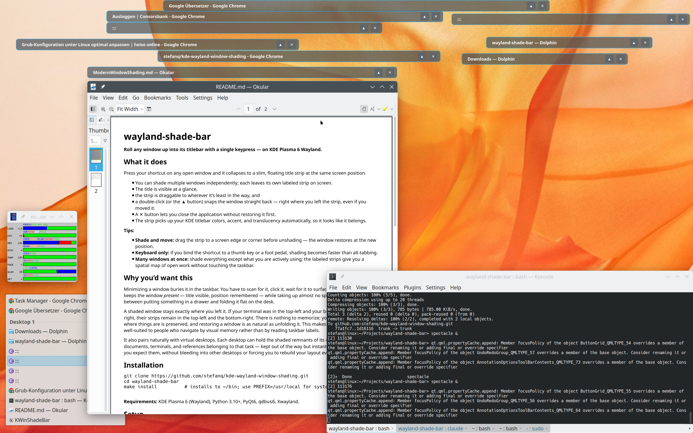

# wayland-shade-bar

**Roll any window up into its titlebar with a single keypress — on KDE Plasma 6 Wayland.**



## What it does

Press your shortcut on any open window and it collapses to a slim, floating title strip at the same screen position.

* You can shade multiple windows independently;
  each leaves its own labeled strip on screen.
* The title is visible at a glance,
* the strip is draggable to wherever it's least in the way, and
* a double-click (or the **▲** button) snaps the window straight back
  — right where you left the strip, even if you moved it.
* A **✕** button lets you close the application without restoring it first.
* The strip picks up your KDE titlebar colors, accent, and translucency
  automatically, so it looks like it belongs.

**Tips:**

- **Shade and move:** drag the strip to a screen edge or corner before unshading — the window restores at the new position.
- **Keyboard only:** if you bind the shortcut to a thumb key or a foot pedal, shading becomes faster than alt-tabbing.
- **Many windows at once:** shade everything except what you are actively using; the labeled strips give you a spatial map of open work without touching the taskbar.

## Why you'd want this

Minimizing a window buries it in the taskbar. You have to scan for it, click it, wait for it to surface. Window shading keeps the window *present* — title visible, position remembered — while taking up almost no space. It is the difference between putting something in a drawer and folding it flat on the desk.

A shaded window stays exactly where you left it. If your terminal was in the top-left and your browser in the bottom-right, their strips remain in the top-left and the bottom-right. There is nothing to memorize: your spatial sense of where things are is preserved, and restoring a window is as natural as unfolding it. This makes shading particularly well-suited to people who navigate by visual memory rather than by reading taskbar labels.

It also pairs naturally with virtual desktops. Each desktop can hold the shaded remnants of its own context — the documents, terminals, and references belonging to that task — kept out of the way but instantly at hand, in the place you expect them, without bleeding into other desktops or forcing you to rebuild your layout every time you switch.

## Installation

```bash
git clone https://github.com/stefanq/kde-wayland-window-shading.git
cd wayland-shade-bar
make install          # installs to ~/bin; use PREFIX=/usr/local for system-wide
```

**Requirements:** KDE Plasma 6 (Wayland), Python 3.10+, PyQt6, `qdbus6`, Xwayland.

## Setup

In **System Settings → Shortcuts → Custom Shortcuts**, add a command shortcut pointing to:

```
~/bin/shadeToggle
```

A good choice is `Ctrl+I`, or any key combination that suits your workflow.

## How it works

Classic KDE on X11 had window shading as a first-class compositor feature. Wayland's architecture — designed around strong client-compositor boundaries for good security and stability reasons — makes a direct equivalent genuinely impractical at the compositor level; the technical reasoning is documented in [KDE Bug #377162](https://bugs.kde.org/show_bug.cgi?id=377162). This tool fills the gap at user-space level instead.

Wayland's protocol design keeps applications from setting their own screen coordinates, and keeps the compositor from forcibly resizing client surfaces — both deliberate choices with sound justification. This tool navigates both constraints:

- A lightweight KWin script (injected on each keypress, unloaded immediately after) reads the target window's title and position, then minimizes it.
- A PyQt6 widget running through Xwayland appears at the exact same coordinates. Xwayland lets KWin honour standard X11 absolute positioning, so the strip lands pixel-accurately across monitors and HiDPI setups.
- On unshade, another KWin script restores the window and moves it to the strip's current position if it was dragged.

Nothing persists between uses: no daemon, no background service, no lingering KWin state.

### Background

Window shading was a well-established feature across early desktop environments — Mac OS (via the WindowShade control panel), FVWM, and Window Maker among them. In KDE on X11 it was a first-class feature of KWin. The Plasma 6 / Wayland transition could not carry it forward: Wayland's protocol design requires clients to manage their own surface buffers, meaning the compositor cannot safely shrink a window below the size the client declared — apps with client-side decorations (GTK4, Electron, Chromium) would crash or misrender. The technical background is documented in [KDE Bug #377162](https://bugs.kde.org/show_bug.cgi?id=377162).

## License

GPL-2.0-or-later — see [LICENSE](LICENSE).
